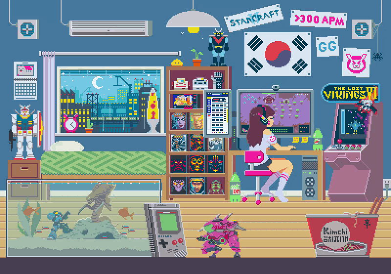

<!-- ============ HERO GIF ============ -->

  

<!-- ============ TYPING ANIMATION (pixel font) ============ -->

  

  
  
  

---

### ▸ About Me

Computer Engineering graduate (Scalable Computing) from **Universiti Teknologi PETRONAS**, with a background in machine learning research and a growing focus on cloud and AI engineering.

- My final year project classified gas types from UAV thermal imagery using a custom CNN (**96.09% accuracy**), later written up as a conference paper
- Currently building hands-on experience with **Azure**, containerised deployments, and LLM-based applications
- Interested in roles where AI, cloud infrastructure, and practical problem-solving meet

### ▸ Projects

| Project | Description | Stack |
|---|---|---|
| **AskWise** | RAG-based FAQ chatbot | FastAPI · FAISS · sentence-transformers · Mistral-7B |
| **TicketTriage** | AI helpdesk ticket classifier (capstone, AI/classification lead) | Python · ML |
| **UAV Gas Classification** | Comparative study of ML and DL models on thermal imagery | Python · TensorFlow · scikit-learn |

### ▸ Tech Stack

  

  
  
  
  

### ▸ Currently Focused On

- Microsoft Azure certifications
- Retrieval-augmented generation (RAG) and LLM applications
- Building and deploying end-to-end AI projects

### ▸ Connect

  
  

<!-- ============ FOOTER ============ -->

  

